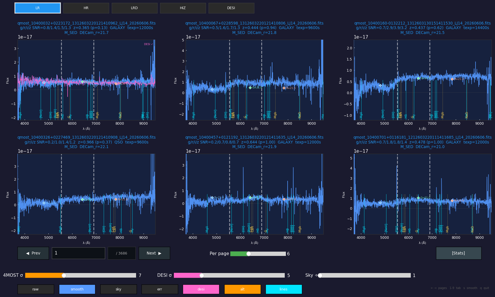

# SpecView4M

Interactive spectrum browser for **4MOST** L1 spectra, with side-by-side **DESI DR1**
comparison, redshifted line markers, and a quality-tagging workflow.

`viewer.py` is a single-file, pure-`matplotlib` GUI for quickly inspecting large sets
of 4MOST low- and high-resolution spectra: page through them in a grid, smooth them,
overlay the matched DESI spectrum (or an alternate 4MOST reduction), mark emission /
absorption lines at the source redshift, and tag each spectrum's quality to disk.


<!-- add a screenshot at docs/screenshot.png -->

---

## Features

**Browsing**
- Grid view of **1–16 spectra per page**; per-panel title font auto-scales with the grid so labels never overlap.
- Tab bar of mutually-exclusive filters:
  - **Resolution arms** — LR / HR / LRD / HIZ
  - **Subsurveys** — M_SED / W_SED / VAR_L / VAR_Z / VAR_G / W_HIZ (assigned by 1″ match to the S16 target catalogue)
  - **DESI** — only spectra with a DESI DR1 match
- Prev / Next, a page-jump box, and `←/→` + number-key shortcuts.

**Display controls**
- Independent **4MOST** and **DESI** Gaussian-smoothing sliders (σ in pixels).
- **Sky-scale** slider.
- Component toggles: `raw`, `smooth`, `sky`, `err`, `desi`, `alt`, `lines`.
- Colour scheme: gray = raw, blue = smoothed, green = sky, red = error, pink = DESI, orange = alternate reduction.

**Overlays**
- **DESI DR1** overlay (pink), matched by coordinate string via `SPV_DESI_match.fits` → `DESI_spectra/targetid_<id>.json`.
- **Alternate-reduction** overlay (orange) from parallel `LR4/ HIZ4/ LRD4/ HR4` directories, matched by coordinate.
- **Redshifted line markers** — major AGN/galaxy emission (cyan) and stellar absorption (amber) lines drawn at their observed wavelength `rest·(1+z)` using the 4XP (`*_xpca.fits`) redshift, with a per-spectrum **custom-z override** (toggle + 0–6.5 slider + text box).

**Quality tagging** (shown when *per page = 1*)
- Quality: **ok / unclear / bad minor / bad major**.
- 9 issue toggles: blue cont. shape, negative cont, B/G join, G/R join, unusual cont (bumpy), unusual cont (norm), telluric lines, gap, incorrect redshift.
- An **"only"** filter per quality to page through just the ok / unclear / bad-minor / bad-major objects within the current tab.
- Tags (and any custom redshift) are saved to `spectra_tags.csv` and reloaded on startup.

**Statistics dashboard** — SNR vs magnitude, redshift histogram, sky map (`0` key).

Every overlay/feature **degrades gracefully**: if the DESI assets, S16 catalogue, xpca
files, or alternate-reduction dirs are missing, the corresponding tab/overlay simply
doesn't appear and the core viewer still runs.

---

## Installation

Requires **Python ≥ 3.9** (tested on 3.11 / 3.12) and an interactive matplotlib
backend (TkAgg, MacOSX, or Qt).

```bash
git clone https://github.com/<you>/SpecView4M.git
cd SpecView4M
python -m pip install -r requirements.txt
```

or with conda/mamba:

```bash
mamba create -n specview python=3.11 numpy pandas matplotlib astropy
mamba activate specview
```

`astropy` is only needed for the subsurvey tabs, xpca redshifts, and DESI-match
reading; the core viewer runs without it.

---

## Usage

```bash
python viewer.py [spectra_headers.csv]
```

If no CSV is given it looks for `spectra_headers.csv` next to `viewer.py`.

### Keyboard shortcuts
| key | action |
|-----|--------|
| `←` / `→` | previous / next page |
| `1`–`9` | select tab (arm / subsurvey / DESI) |
| `s` | cycle 4MOST smoothing |
| `0` | toggle statistics dashboard |
| `q` / `Esc` | quit |

---

## 4MOST ↔ DESI comparison (`plot_desi_ratio.py`)

A companion script that quantifies how the 4MOST spectrophotometry compares to
**DESI DR1** across wavelength. For every LR spectrum with a DESI match it regrids
both spectra to a common 1 Å grid, smooths each on a 10 Å scale, forms the ratio
**4MOST / DESI**, and shows the wavelength-resolved **median** and the **14/86, 5/95,
1/99 percentile** envelopes (log y-axis).

```bash
python plot_desi_ratio.py [spectra_headers.csv] [options]
```

| option | effect |
|--------|--------|
| `--split none` | single overall panel (default is `rmag`) |
| `--split snr` | one panel per `SNR_R` bin (0-1, 1-2, 2-4, 4-8, >8) |
| `--split rmag` | one panel per `CAT_MAG` bin (17-18 … 21-22) |
| `--normalize` | divide each ratio by its value at the norm wavelength first — isolates the *spectral shape* from the per-object flux offset |
| `--norm-wave X` | normalisation wavelength in Å (default 5500) |
| `--recon alt` | use the alternate reduction (`LR4/`, matched by coord) as the 4MOST side |
| `--seeing-max X` | keep only spectra with DIMM seeing (`FWHM_AMBI` from `conditions.csv`) below X″ |
| `--recompute` | rebuild the per-spectrum ratio cache from the spectra |

Examples:

```bash
# overall shape comparison, normalised at 5500 Å
python plot_desi_ratio.py --split none --normalize

# by magnitude, restricted to good seeing
python plot_desi_ratio.py --split rmag --seeing-max 1.0

# by SNR, using the alternate reduction
python plot_desi_ratio.py --split snr --recon alt
```

The per-spectrum ratios are cached to `PLOTS/desi_ratio_cache[_alt].npz`, so re-plots
with different splits/normalisation are instant; only `--recompute` (or changed input
spectra) re-reads the FITS/JSON. Figures are written to `PLOTS/desi_ratio_*.png`.

Needs the DESI assets (`SPV_DESI_match.fits`, `DESI_spectra/`) and — for the seeing
cut — `conditions.csv`. It imports the readers from `viewer.py`, so keep the two
scripts together.

---

## Expected data layout

`viewer.py` reads a header CSV plus the underlying FITS files. Optional assets unlock
extra features; place them next to `viewer.py` (or point the CSV's `filepath` column at
the spectra).

| path | purpose | required |
|------|---------|----------|
| `spectra_headers.csv` | one row per spectrum: `filepath`, `filename`, `category` (LR/HR/LRD/HIZ), `RA`, `DEC`, SNR/mag columns, … | **yes** |
| `LR/ HR/ LRD/ HIZ/` | 4MOST L1 FITS spectra | **yes** |
| `SPV_DESI_match.fits` + `DESI_spectra/*.json` | DESI DR1 overlay & tab | no |
| `S16_*_target_catalogue.fits.gz` | subsurvey tabs (cached to `.subsurvey_cache.csv`) | no |
| `LR_xpca.fits`, `LRD_xpca.fits`, `HIZ_xpca.fits`, `HR_xpca.fits` | 4XP redshifts for line markers | no |
| `LR4/ HIZ4/ LRD4/ HR4/` | alternate-reduction overlay | no |
| `spectra_tags.csv` | quality tags (created/updated by the viewer) | auto |

The CSV `filepath` column may be absolute or relative to the CSV; unresolved names are
looked up once by basename across the category directories.

---

## Notes
- The viewer installs a small guard for a known matplotlib bug where a window-resize
  event reaches a widget handler (`AttributeError: 'ResizeEvent' … 'inaxes'`); only that
  specific error is silenced.
- Default startup shows the smoothed 4MOST (σ=7) and DESI (σ=5) traces with raw/err/sky
  hidden.

## License
MIT — see [LICENSE](LICENSE).
